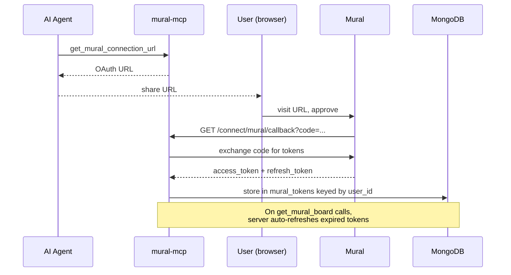
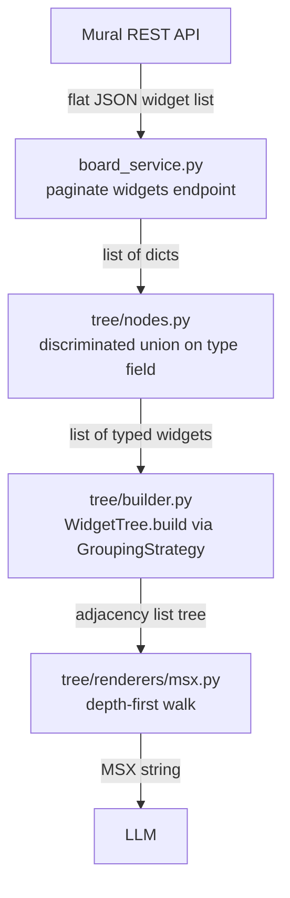

# mural-mcp

An MCP (Model Context Protocol) server that exposes [Mural](https://www.mural.co/) boards to AI agents. AI agents connect to the server at `/mcp` using a bearer token and call three MCP tools to authenticate with Mural (via OAuth 2.0), disconnect, or fetch a board. When a board is fetched, the server translates the flat JSON widget list from the Mural REST API into a hierarchical tree, then renders it as MSX (Mural JSX-style markup) — a compact, LLM-friendly format that preserves board structure, styling, and content.

## Requirements

- Python `>= 3.14`
- [uv](https://docs.astral.sh/uv/)
- Docker (for local dependencies)

## Setup

```bash
uv sync
```

## Configuration

The app is configured via environment variables, managed by Pydantic `BaseSettings` in `app/config.py`.

| Variable | Default | Description |
| :--- | :--- | :--- |
| `PYTHON_ENV` | `None` | Set to `development` to enable hot-reload |
| `HOST` | `127.0.0.1` | Server host |
| `PORT` | `8086` | Server port |
| `MONGO_URI` | `None` | MongoDB connection URI |
| `MONGO_DATABASE` | `mural-mcp` | MongoDB database name |
| `HTTP_PROXY` | `None` | Outbound HTTP proxy URL |
| `TRACING_HEADER` | `x-cdp-request-id` | Request tracing header name |

For local development, set variables in `compose/aws.env` and secrets in `compose/secrets.env` (gitignored).

## MCP Tools

The server exposes three tools to AI agents:

- **`get_mural_connection_url(user_id)`** — Returns a Mural OAuth 2.0 authorization URL. The user visits this URL in their browser to connect their Mural account to the server.
- **`disconnect_mural(user_id)`** — Removes stored Mural OAuth tokens for a user, disconnecting their account.
- **`get_mural_board(mural_id, user_id)`** — Fetches a Mural board by ID and returns its content as MSX markup.

Every tool call includes a `user_id` automatically extracted from the MCP bearer token's `email` claim.

## How it works

### Auth

The server uses two independent authentication layers.

#### MCP bearer token (AI agent → server)

Every request to `/mcp` must carry an `Authorization: Bearer <token>` header. The server validates the token against a MongoDB `bearer_tokens` collection and extracts the `email` claim, which becomes the `user_id` for that tool call.

```mermaid
sequenceDiagram
    participant Agent as AI Agent
    participant Server as mural-mcp
    participant Mongo as MongoDB

    Agent->>Server: POST /mcp<br/>Authorization: Bearer &lt;token&gt;
    Server->>Mongo: lookup token in bearer_tokens
    Mongo-->>Server: {email}
    Server-->>Agent: tool response (user_id = email)
```

#### Mural OAuth 2.0 (server → Mural API)

The server acts as an OAuth client toward Mural:

1. The `get_mural_connection_url` tool generates a Mural OAuth URL (scope: `murals:read identity:read`).
2. The user visits the URL and approves access; Mural redirects to `/connect/mural/callback?code=...`.
3. The server exchanges the code for an access token and refresh token, storing both in MongoDB (`mural_tokens`).
4. On every `get_mural_board` call, the server checks token expiry and automatically refreshes if needed.



### Board translation pipeline

The `get_mural_board` tool orchestrates a multi-stage pipeline to transform a Mural board from flat JSON into MSX markup.



**Stage 1: Fetch**  
`board_service.py` paginates `GET /public/v1/murals/{id}/widgets` and collects a flat list of raw widget JSON.

**Stage 2: Parse**  
`tree/nodes.py` uses a Pydantic discriminated union on the `type` field to deserialize each raw dict into one of 11 strongly-typed widget models (`tree/widgets.py`):
- Structural: `AreaWidget`
- Content: `StickyNoteWidget`, `ShapeWidget`, `TextWidget`, `IconWidget`, `ImageWidget`, `FileWidget`, `CommentWidget`
- Relational: `ArrowWidget`
- Table: `TableWidget`, `TableCellWidget`

**Stage 3: Build tree**  
`tree/builder.py` converts the flat widget list into a hierarchical tree using a `GroupingStrategy`. The default (`ParentIdStrategy`) uses the `parent_id` field from the API response. An alternative `SpatialGroupingStrategy` infers hierarchy from physical canvas proximity instead. Tables receive special treatment: they are always expanded into synthetic `TableRowNode` and `TableColumnNode` objects to represent the logical grid structure.

**Stage 4: Render MSX**  
`tree/renderers/msx.py` walks the tree depth-first and emits MSX markup. Self-closing tags are used for leaf nodes; indented open/close tags for containers.

### MSX format

MSX is a compact, JSX-style XML markup format designed to make Mural board content readable by LLMs. Each widget type maps to a tag name and a set of attributes. Text content (sticky note text, comments, etc.) is rendered as tag inner text rather than an attribute.

**Example:**

```xml
<Area id="area-1" title="Sprint 4" layout="free" background_color="#F0F0F0">
  <StickyNote id="sn-1" color="#FFD700" tags="todo">Improve onboarding</StickyNote>
  <StickyNote id="sn-2" color="#90EE90" tags="done">Ship the login page</StickyNote>
  <Table id="tbl-1" border_color="#000" border_width="1">
    <Row id="row-1">
      <Column id="row-1/col-1">
        <TableCell id="cell-1" background_color="#FFF"/>
      </Column>
    </Row>
  </Table>
</Area>
<Arrow id="arr-1" arrow_type="straight" tip="sharp" start_ref_id="sn-1" end_ref_id="sn-2"/>
```

**Widget-to-tag mapping:**

| Widget | MSX tag | Key attributes |
|---|---|---|
| `StickyNoteWidget` | `<StickyNote>` | color, font, font_size, text_align, tags |
| `ShapeWidget` | `<Shape>` | shape, title, background_color, border_color, font_color, font, font_size, text_align |
| `TextWidget` | `<Text>` | title, background_color, font, font_size, text_align |
| `IconWidget` | `<Icon>` | name, title, color |
| `AreaWidget` | `<Area>` | title, layout, background_color, border_color, border_style |
| `ImageWidget` | `<Image>` | url |
| `TableWidget` | `<Table>` | border_color, border_width |
| `TableCellWidget` | `<TableCell>` | background_color |
| `ArrowWidget` | `<Arrow>` | arrow_type, tip, stroke_color, stroke_style, stroke_width, start_ref_id, end_ref_id |
| `CommentWidget` | `<Comment>` | replies |
| `FileWidget` | `<File>` | title, url |
| `TableRowNode` (synthetic) | `<Row>` | — |
| `TableColumnNode` (synthetic) | `<Column>` | — |
| `SpatialGroupNode` (synthetic) | `<Group>` | centroid_x, centroid_y |

## Running locally

**Using Docker Compose** (recommended — starts MongoDB and Localstack):

```bash
docker compose --profile service up --build
```

**Using the dev script** (starts dependencies in Docker, runs the app directly):

```bash
./scripts/start_dev_server.sh
```

The service runs on `http://localhost:8086`.

## Development tasks

```bash
# Lint and format check
uv run task lint

# Type check
uv run task typecheck

# Full test suite (lint + typecheck + pytest + coverage)
uv run task test

# Auto-fix formatting
uv run task format
```

## Testing

Tests are organized into `tests/unit/` and `tests/integration/` mirroring the `app/` directory structure.

### Running tests

```bash
# Run unit tests only (fast, no network calls)
uv run pytest -m "not integration"

# Run all tests including integration tests
uv run pytest

# Run a specific test file
uv run pytest tests/unit/mural/test_auth.py -vv

# Run with coverage
uv run coverage run -m pytest && uv run coverage report
```

### Integration tests with VCR

Integration tests use [vcrpy](https://vcrpy.readthedocs.io/) to record and replay HTTP interactions. Cassettes are stored in `tests/cassettes/` with authorization headers filtered for security.

```bash
# Run integration tests only
uv run pytest -m "integration"

# Re-record cassettes (for updated API responses)
VCR_RECORD_MODE=once uv run pytest -m "integration" tests/integration/mural/test_widgets_api.py
```

**Important:** When re-recording cassettes, verify that authorization headers are properly filtered (they should appear as `[FILTERED]` in the YAML files).

## API endpoints

| Endpoint | Description |
| :--- | :--- |
| `POST /mcp` | MCP StreamableHTTP transport (bearer token required) |
| `GET /connect/mural/callback` | Mural OAuth 2.0 redirect handler |
| `GET /health` | Health check |
| `GET /docs` | Swagger UI |
| `GET /example/test` | Basic example (development only) |
| `GET /example/db` | MongoDB example (development only) |
| `GET /example/http` | HTTP client example (development only) |
