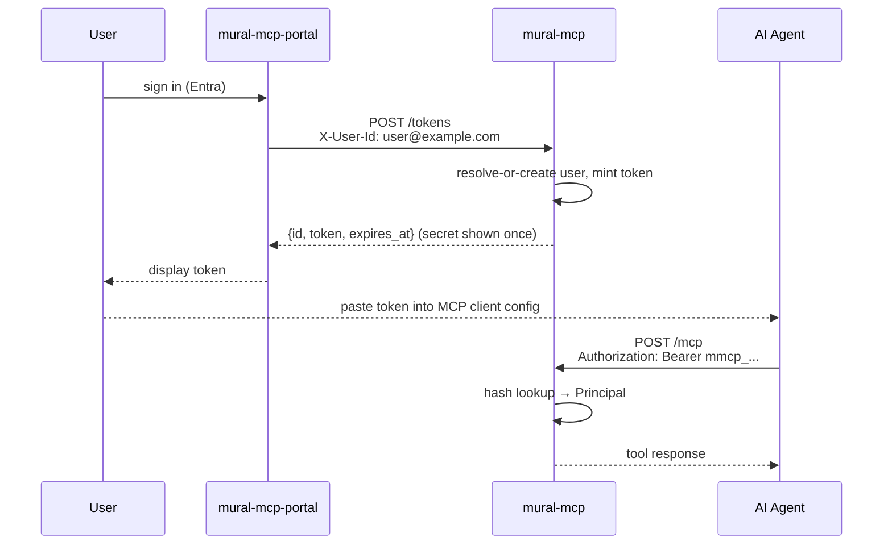
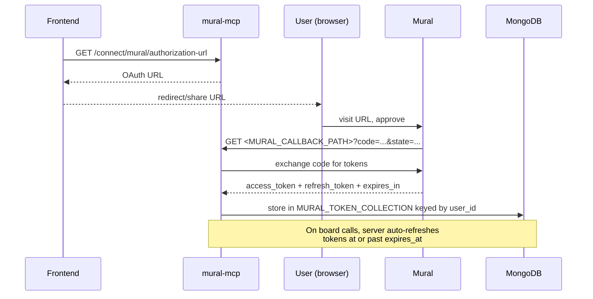
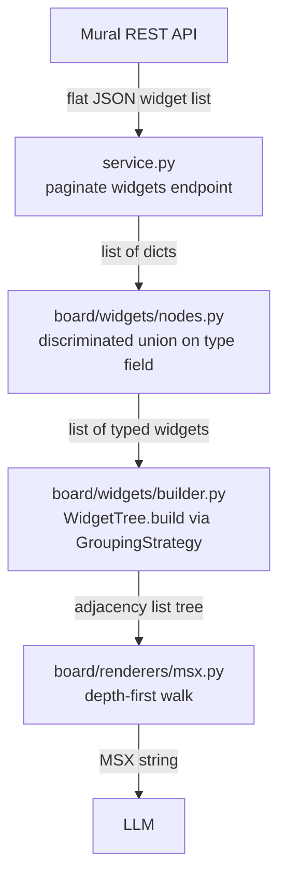

# mural-mcp

An MCP (Model Context Protocol) server that exposes [Mural](https://www.mural.co/) boards to AI agents. AI agents connect to the server at `/mcp` using a bearer token and call MCP tools to fetch a board summary, drill into a region, inspect widget connections, or search widgets by content — the Mural account itself is connected up front via the frontend, not by the agent. Board content comes back as MSX (Mural JSX-style markup) — a compact, LLM-friendly format that preserves board structure, styling, and content.

## Requirements

- Python `>= 3.13`
- [uv](https://docs.astral.sh/uv/)
- Docker (for local MongoDB)

## Setup

```bash
uv sync
cp .env.example .env  # then fill in MURAL_CLIENT_ID, MURAL_CLIENT_SECRET, BASE_URL
```

## Configuration

The app is configured via environment variables, managed by Pydantic `BaseSettings` in `app/config.py`. See `.env.example` for a filled-in starting point.

| Variable | Default | Description |
| :--- | :--- | :--- |
| `BASE_URL` | *(required)* | Public base URL of this server; used to build the Mural OAuth redirect URI |
| `SERVER_NAME` | `mural-mcp` | Name reported by the MCP server |
| `PYTHON_ENV` | `None` | Set to `development` to enable hot-reload |
| `HOST` | `127.0.0.1` | Server host |
| `PORT` | `8086` | Server port |
| `LOG_CONFIG` | `None` | Path to a uvicorn logging config file |
| `MONGO_URI` | `None` | MongoDB connection URI |
| `MONGO_DATABASE` | `mural-mcp` | MongoDB database name |
| `MONGO_TRUSTSTORE` | `TRUSTSTORE_CDP_ROOT_CA` | Env var name holding a custom CA cert for the Mongo TLS connection, if set |
| `AWS_ENDPOINT_URL` | `None` | AWS endpoint override, e.g. for LocalStack in local dev |
| `HTTP_PROXY` | `None` | Outbound HTTP proxy URL |
| `TRACING_HEADER` | `x-cdp-request-id` | Request tracing header name |
| `RESOURCE_GUARD_MODE` | `allow_all` | `allow_all` lets every board request through; `allow_list` denies a board unless an approved access request exists for the (user, board) pair — see [Board access requests](#board-access-requests) |
| `ACCESS_REQUEST_COLLECTION` | `board_approvals` | Mongo collection for board access requests |
| `REST_AUTH_MODE` | `trusted` | `trusted` (network-asserted `X-User-Id` header) or `token` (personal access token) for REST/admin routes. `/mcp` and `/tokens` are unaffected — see [Auth](#auth) |
| `TRUSTED_USER_HEADER` | `X-User-Id` | Header the portal uses to assert the caller in `trusted` mode |
| `IDENTITY_TOKEN_PREFIX` | `mmcp_` | Prefix on every minted personal access token |
| `IDENTITY_DEFAULT_TTL_DAYS` | `90` | Default token lifetime |
| `IDENTITY_MAX_TTL_DAYS` | `365` | Longest lifetime a caller may request |
| `IDENTITY_LAST_USED_THROTTLE_SECONDS` | `300` | Minimum interval between `last_used_at` writes for the same token |
| `USER_COLLECTION` | `users` | Mongo collection for resolved identities |
| `PAT_COLLECTION` | `personal_access_tokens` | Mongo collection for personal access tokens |
| `MURAL_API_BASE` | `https://app.mural.co/api` | Mural API base URL |
| `MURAL_AUTHORIZE_PATH` | `/public/v1/authorization/oauth2/` | Mural OAuth authorize path |
| `MURAL_TOKEN_PATH` | `/public/v1/authorization/oauth2/token` | Mural OAuth token path |
| `MURAL_SCOPES` | `murals:read identity:read` | Space-separated Mural OAuth scopes requested |
| `MURAL_CLIENT_ID` | *(required)* | Mural OAuth app client ID |
| `MURAL_CLIENT_SECRET` | *(required)* | Mural OAuth app client secret |
| `MURAL_CALLBACK_PATH` | *(required)* | Path this server's OAuth callback route listens on, e.g. `/connect/mural/callback` |
| `MURAL_TOKEN_COLLECTION` | `mural_tokens` | Mongo collection for stored Mural OAuth tokens |
| `MURAL_OAUTH_STATE_COLLECTION` | `oauth_states` | Mongo collection for in-flight OAuth state tokens (TTL-indexed) |

Local development uses a single root `.env` file, loaded by both `compose.yaml` and Pydantic directly. `.env` is gitignored.

## MCP Tools

The server exposes four tools to AI agents, resolved against the current `Principal` (see [Auth](#auth) — no `user_id` parameter is passed explicitly):

- **`get_board_summary(mural_id, use_spatial_grouping=False)`** — Returns a compact MSX summary of the board's top-level regions, with labels, widget counts, and bounds.
- **`get_region(mural_id, region_id, use_spatial_grouping=False)`** — Returns full MSX for all widgets within a board region (an area, or a spatial group when `use_spatial_grouping=True`).
- **`get_connections(mural_id, widget_id)`** — Returns all arrows connected to a widget and their resolved endpoints.
- **`find_widgets(mural_id, query=None, widget_type=None)`** — Searches board widgets by text content and/or widget type; at least one of `query`/`widget_type` is required.

Connecting/disconnecting a Mural account is a frontend concern, not an MCP tool — the frontend drives it via the REST routes under `/connect` (`GET /connect/mural/authorization-url`, `GET /connect/mural/callback`) — see [API endpoints](#api-endpoints).

## How it works

### Auth

The server uses two independent authentication layers.

#### Personal access tokens (AI agent → server)

mural-mcp mints its own bearer tokens rather than validating an external IdP's signature. The portal (which does authenticate the user via Entra) asserts the signed-in user via a trusted `X-User-Id` header against `POST /tokens`; the server resolves that identity to its own opaque `user_id`, mints an opaque token (`mmcp_...`), and returns the plaintext secret exactly once — only its SHA-256 hash is ever persisted, so there is no endpoint that can return it again. The portal shows the token to the user, who pastes it into their MCP client.

Every request to `/mcp` (and, in `REST_AUTH_MODE=token`, the REST/admin surface) must carry `Authorization: Bearer <token>`. The server looks the token up by hash — no signature to verify, since it minted the token itself — and resolves it to a `Principal`.



Tokens can be listed and revoked via `GET /tokens` / `DELETE /tokens/{id}` (same trusted-header auth as minting).

#### Mural OAuth 2.0 (server → Mural API)

The server acts as an OAuth client toward Mural. Account linking is driven entirely by the frontend, not by an MCP tool call — the AI agent only ever sees the resulting board tools work or raise "connect your Mural account first":

1. The frontend calls `GET /connect/mural/authorization-url` to get a Mural OAuth URL (scope: `MURAL_SCOPES`).
2. The user visits the URL and approves access; Mural redirects to the path configured by `MURAL_CALLBACK_PATH`.
3. The server exchanges the code for an access token and refresh token, storing both (plus expiry) in MongoDB (`MURAL_TOKEN_COLLECTION`).
4. On every board call, the server checks `expires_at` and automatically refreshes if the token is expired or about to expire.



### Board access requests

Board access is governed by `RESOURCE_GUARD_MODE`. In `allow_list` mode, a user must have an approved `BoardAccessRequest` for a given board before any board tool/route will serve it:

- `POST /approvals/boards` — the user requests access to a board, naming an Information Asset Owner (IAO) and a reason.
- `GET /approvals/boards/{board_id}` — the user checks the status of their request.
- `GET /admin/access-requests` — the portal lists pending requests for IAO review.
- `POST /admin/access-requests/{request_id}/approve` / `.../reject` — the portal records the IAO's decision, including (for approvals) references to the data-handling form and risk assessment.

In `allow_all` mode (the default), this workflow still records requests and decisions, but nothing is enforced — flip to `allow_list` only once the admin review workflow has real approvals to check against, since flipping first denies all traffic.

### Local development

There is no signature-verification bypass to enable — the server always looks up a real minted token. Mint one directly against the running service, using the trusted-header route the portal would otherwise call:

```bash
curl -X POST localhost:8086/tokens \
  -H "X-User-Id: dev@example.com" \
  -H "Content-Type: application/json" \
  -d '{"label": "local"}'
```

Use the returned `token` as a Bearer token against `/mcp` or any REST route.

### Board translation pipeline

Board tools orchestrate a multi-stage pipeline to transform a Mural board from flat JSON into MSX markup, in `app/integration/resource/`.



**Stage 1: Fetch**
`BoardService._fetch_widgets` (`app/integration/resource/service.py`) paginates `GET /public/v1/murals/{id}/widgets` and collects a flat list of raw widget JSON.

**Stage 2: Parse**
`board/widgets/nodes.py` uses a Pydantic discriminated union on the `type` field to deserialize each raw dict into one of the strongly-typed widget models in `board/widgets/schemas.py`:
- Structural: `AreaWidget`
- Content: `StickyNoteWidget`, `ShapeWidget`, `TextWidget`, `IconWidget`, `ImageWidget`, `FileWidget`, `CommentWidget`
- Relational: `ArrowWidget`
- Table: `TableWidget`, `TableCellWidget`

**Stage 3: Build tree**
`board/widgets/builder.py` converts the flat widget list into a hierarchical tree using a `GroupingStrategy` (`board/widgets/strategies/`). The default (`ParentIdStrategy`) uses the `parent_id` field from the API response. An alternative `SpatialGroupingStrategy` infers hierarchy from physical canvas proximity instead. Tables receive special treatment: they are always expanded into synthetic `TableRowNode` and `TableColumnNode` objects to represent the logical grid structure.

**Stage 4: Render MSX**
`board/renderers/msx.py` walks the tree depth-first and emits MSX markup, using the tag/attribute mapping in `board/registry.py`. Self-closing tags are used for leaf nodes; indented open/close tags for containers. `get_board_summary` instead builds a `BoardSummary` (`board/summary/builder.py`) over top-level regions and renders it with `board/summary/renderer.py`.

### MSX format

MSX is a compact, JSX-style XML markup format designed to make Mural board content readable by LLMs. Each widget type maps to a tag name and a set of attributes. Text content (sticky note text, comments, etc.) is rendered as tag inner text rather than an attribute.

**Example:**

```xml
<Area id="area-1" title="Sprint 4" layout="free" background_color="#F0F0F0">
  <StickyNote id="sn-1" color="#FFD700" text_align="left" role="label" tags="todo">Improve onboarding</StickyNote>
  <StickyNote id="sn-2" color="#90EE90" text_align="left" role="label" tags="done">Ship the login page</StickyNote>
  <Table id="tbl-1" border_color="#000" border_width="1">
    <Row id="row-1">
      <Column id="row-1/col-1">
        <TableCell id="cell-1" background_color="#FFF"/>
      </Column>
    </Row>
  </Table>
</Area>
<Arrow id="arr-1" arrow_type="straight" tip="sharp" stroke_color="#000" start_ref_id="sn-1" end_ref_id="sn-2"/>
```

**Widget-to-tag mapping** (`app/integration/resource/board/registry.py`):

| Widget | MSX tag | Key attributes |
|---|---|---|
| `StickyNoteWidget` | `<StickyNote>` | id, color, text_align, role, tags, rotation |
| `ShapeWidget` | `<Shape>` | id, shape, title, background_color, border_color, font_color, text_align, role, rotation |
| `TextWidget` | `<Text>` | id, title, background_color, text_align, role, rotation |
| `IconWidget` | `<Icon>` | id, name, title, color, rotation |
| `AreaWidget` | `<Area>` | id, title, layout, background_color, border_color, border_style, role |
| `ImageWidget` | `<Image>` | id, url, rotation |
| `TableWidget` | `<Table>` | id, border_color, border_width |
| `TableCellWidget` | `<TableCell>` | id, background_color |
| `ArrowWidget` | `<Arrow>` | id, arrow_type, tip, stroke_color, start_ref_id, end_ref_id |
| `CommentWidget` | `<Comment>` | id, replies |
| `FileWidget` | `<File>` | id, title, url, rotation |
| `TableRowNode` (synthetic) | `<Row>` | id |
| `TableColumnNode` (synthetic) | `<Column>` | id |
| `SpatialGroupNode` (synthetic) | `<Group>` | id, centroid_x, centroid_y |

## Running locally

**Using Docker Compose** (starts MongoDB and the app):

```bash
docker compose up --build
```

The service runs on `http://localhost:8085` (compose overrides `PORT`; see `compose.yaml`). Environment variables come from the root `.env` file (`env_file: - ".env"`).

**Running the app directly** (bring your own MongoDB, e.g. `docker compose up mongodb`):

```bash
uv run mural-mcp-http
```

This runs on `HOST:PORT` from your environment (default `127.0.0.1:8086`).

## Development tasks

```bash
# Lint and format check
uv run task lint

# Type check
uv run task typecheck

# Full test suite (lint + typecheck + pytest + coverage)
uv run task test

# Auto-fix formatting
uv run task format
```

## Testing

Tests are organized into `tests/unit/` and `tests/integration/` mirroring the `app/` directory structure. Filenames are unique across the whole `tests/` tree (there are no `__init__.py` files anywhere, so pytest resolves imports by basename).

### Running tests

```bash
# Run unit tests only (fast, no network calls)
uv run pytest -m "not integration"

# Run all tests including integration tests
uv run pytest

# Run a specific test file
uv run pytest tests/unit/integration/linking/test_oauth_client.py -vv

# Run with coverage
uv run coverage run -m pytest && uv run coverage report
```

### Integration tests with VCR

Integration tests use [vcrpy](https://vcrpy.readthedocs.io/) to record and replay HTTP interactions. Cassettes are stored in `tests/cassettes/` with authorization headers filtered for security.

```bash
# Run integration tests only
uv run pytest -m "integration"

# Re-record cassettes (for updated API responses)
VCR_RECORD_MODE=once uv run pytest -m "integration" tests/integration/resource/test_widgets_api.py
```

**Important:** When re-recording cassettes, verify that authorization headers are properly filtered (they should appear as `[FILTERED]` in the YAML files).

## API endpoints

| Endpoint | Description |
| :--- | :--- |
| `POST /mcp` | MCP StreamableHTTP transport (bearer token required) |
| `GET /boards/{mural_id}/summary` | Compact MSX summary of a board's top-level regions |
| `GET /boards/{mural_id}/regions/{region_id}` | Full MSX for a board region |
| `GET /boards/{mural_id}/connections/{widget_id}` | Arrows connected to a widget |
| `GET /boards/{mural_id}/widgets` | Search widgets by `query` and/or `widget_type` |
| `GET /connect/mural/authorization-url` | Mural OAuth 2.0 authorization URL for the frontend to redirect the user to |
| `GET /connect/mural/callback` | Mural OAuth 2.0 redirect handler |
| `POST /tokens` | Mint a personal access token (trusted header) |
| `GET /tokens` | List the caller's personal access tokens (trusted header) |
| `DELETE /tokens/{id}` | Revoke a personal access token (trusted header) |
| `POST /approvals/boards` | Request access to a board |
| `GET /approvals/boards/{board_id}` | Check the status of a board access request |
| `GET /admin/access-requests` | List pending board access requests (portal/IAO) |
| `POST /admin/access-requests/{request_id}/approve` | Approve a board access request |
| `POST /admin/access-requests/{request_id}/reject` | Reject a board access request |
| `GET /health` | Health check |
| `GET /docs` | Swagger UI |
